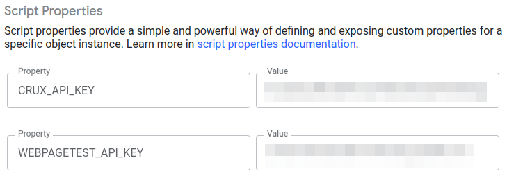

# Performance Audit

[](https://github.com/google/clasp)
[](https://github.com/jackdbd/performance-audit/actions/workflows/ci.yaml)

Google Sheets that I use to retrieve **field data** from [CrUX BigQuery dataset](https://developer.chrome.com/docs/crux/bigquery/) and generate **lab data** from the [WebPageTest API](https://docs.webpagetest.org/api/reference/).

> :information_source: Read [this article](https://web.dev/lab-and-field-data-differences/) to understand the difference between field data and lab data.

Inspired by [WebPageTest Google Sheets Bulk Tester](https://github.com/WebPageTest/WebPageTest-Bulk-Tester).

## How to use it?

This Apps Script project is [bound to a single Google Sheets](https://developers.google.com/apps-script/guides/bound), so it behaves like an **unpublished** [Editor Add-on](https://developers.google.com/apps-script/add-ons/concepts/types#editor-add-ons). In order to use it, you need to **copy** [this Google Sheets](https://docs.google.com/spreadsheets/d/12Z3HBsRuuJp8yXTa9uaK2CzY6so_uIOrRGa8kaq8ZPk).

## Configuration

Copy your WebPageTest API key in the [Script Properties](https://developers.google.com/apps-script/guides/properties). Only those ones that have access to your Google Sheets will be able to view these properties. Properties are never shared between scripts.



## Installation

Install all the necessary dependencies to build, test, deploy this application.

```sh
npm install
```

## Test

Run tests in watch mode with [vitest](https://vitest.dev/).

```sh
npm run test
```

Run all tests once and generate a coverage reports.

```sh
npm run test:coverage
```

## Development

Run a [vite](https://vitejs.dev/guide/) dev server for each of the frontend components.

```sh
npm run dev
```

Each frontend component will be served as a standalone web app on a different port (e.g. 5173, 5174).

## Deploy

Push changes to the Google Apps Script server. The code pushed will be the [head deployment](https://developers.google.com/apps-script/concepts/deployments#head_deployments) of this [container-bound Apps Script](https://developers.google.com/apps-script/guides/bound) project.

```sh
npm run deploy
```

> :information_source: I prefer to deploy this script manually, because deploying it automatically from the CI workflow would require to store the `.clasprc.json` credentials in a GitHub secret.

You can double-check which files will be pushed to Apps Script using this command.

```sh
npx clasp status
```

Open the project on `script.google.com`.

```sh
npx clasp open
```

## Other

- Apps Script Manifest (i.e. `appsscript.json`): see [here](https://developers.google.com/apps-script/concepts/manifests) and [here](https://developers.google.com/apps-script/manifest).
- Project Settings File (i.e. `.clasp.json`): see [here](https://github.com/google/clasp#project-settings-file-claspjson).
- OAuth scopes: see [here](https://developers.google.com/apps-script/add-ons/concepts/workspace-scopes) and [here](https://developers.google.com/apps-script/add-ons/concepts/editor-scopes).
- Invoke an Apps Script function remotely: see [here](https://github.com/google/clasp/blob/master/docs/run.md).

CrUX datasets by Google are licensed under a [Creative Commons Attribution 4.0 International License](https://creativecommons.org/licenses/by/4.0/).
