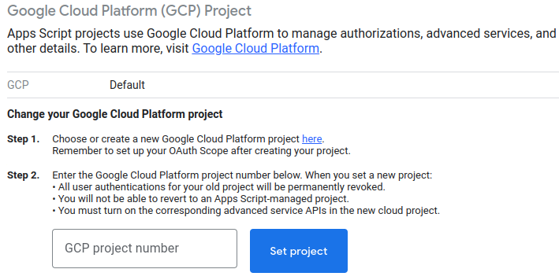

# Performance Audit

[](https://github.com/google/clasp)
[](https://github.com/jackdbd/performance-audit/actions/workflows/ci.yaml)

Retrieve field performance data from the [Chrome UX Report](https://developer.chrome.com/docs/crux/) and launch [WebPageTest](https://docs.webpagetest.org/api/reference/) without leaving Google Sheets.

## What is this?

This project is a Google Apps Script [container-bound script](https://developers.google.com/apps-script/guides/bound) that I use for my [website audit consultation service](https://www.giacomodebidda.com/services/website-audit/). I use it to retrieve **field performance data** from the [CrUX BigQuery dataset](https://developer.chrome.com/docs/crux/bigquery/) and the [CrUX History API](https://developer.chrome.com/docs/crux/history-api/), and to invoke the [WebPageTest API](https://docs.webpagetest.org/api/reference/), which will provide me with some **lab data** for the analysis.

You can use it too! Simply copy [this spreadsheet](https://docs.google.com/spreadsheets/d/12Z3HBsRuuJp8yXTa9uaK2CzY6so_uIOrRGa8kaq8ZPk/) and read the instructions below to configure it and learn how to use it.

### What are field data and lab data?

Read [this article](https://web.dev/lab-and-field-data-differences/) to understand the difference between field data and lab data in the context of web performance.

### What is a container-bound script?

A container-bound script extends the functionality of the Google Sheets it is bound to. A bound script is effectively an unpublished [Apps Script Editor add-on](https://developers.google.com/apps-script/add-ons/concepts/types#editor-add-ons) that functions only for the Google Sheets file it is bound to.

## How do I use this tool?

If you want to use this tool, you need to create a copy of [this spreadsheet](https://docs.google.com/spreadsheets/d/12Z3HBsRuuJp8yXTa9uaK2CzY6so_uIOrRGa8kaq8ZPk/) by clicking on `File` > `Make a copy`. By doing so, Google Sheets will copy the entire Apps Script project into your spreadsheet. There is no need to clone this repository if you want to use the tool as it is.

You also need to copy your CrUX API key and your WebPageTest API key, and paste them in the [Script Properties](https://developers.google.com/apps-script/guides/properties). Only those users that have access to your Google Sheets will be able to view these properties. Properties are never shared between scripts.


> :information_source: See [here](https://developer.chrome.com/docs/crux/api/#crux-api-key) to learn how to create an API key that you can use to call both the [CrUX API](https://developer.chrome.com/docs/crux/api/) and the [CrUX History API](https://developer.chrome.com/docs/crux/history-api/).

When you create an Apps Script project, Apps Script creates a default Cloud project that operates in the background. However, this application needs to execute functions in your script project using the Apps Script API's `scripts.run` method, so it requires a standard Google Cloud Platform project. For details, see [here](https://developers.google.com/apps-script/guides/cloud-platform-projects#standard) and [here](https://stackoverflow.com/questions/66607729/how-to-programmatically-deploy-a-google-apps-script-as-a-standard-gcp-project).

**TODO**: how to retrieve the GCP Project ID dynamically?



The first time you run this project, you will need to authorize it.


Down below you can watch a few videos that show how to use this tool.

https://github.com/jackdbd/performance-audit/assets/5048090/05f3d619-5f53-4df2-b01e-b0edcfbb8112

https://github.com/jackdbd/performance-audit/assets/5048090/67e9f06e-96a2-4217-81a8-7e48920516cf

## How do I modify this project?

If you want to modify the Apps Script project tied to the Google Sheets preadsheet, you essentially have two options:

- With [clasp](https://github.com/google/clasp): clone this repository, replace `scriptId` and `projectId` in the `.clasp.json` file with your own values, develop the project as any other software project (commit changes in source control, push to remote repo, deploy, make a PR, etc). This is my recommended approach.
- Without clasp: make a copy of the spreadsheet, edit the code directly in Google Sheets, in `Extensions` > `Apps Script`. I would not recommend this approach: you would have no version control, no automatic tests to run on the CI, and the frontend code would be impossible to read since it is a single JS bundle.

## Tech stack and environments

This project consists of some backend code and several frontend components.

In the **production** environment, the backend code runs on the Apps Script servers, which host a [V8-based runtime](https://developers.google.com/apps-script/guides/v8-runtime) somewhat similar to Node.js. Each frontend component runs in the browser and it is sandboxed in an `<iframe>` by the **host application** (i.e. Google Sheets) for [security reasons](https://developers.google.com/apps-script/guides/html/restrictions).

In the **development** environment, the backend code runs on Node.js. Each frontend component runs in the browser as a standalone web app, each component on a different port. This makes developing each frontend component easy using one [vite](https://vitejs.dev/guide/) development server for each component.

In the **test** environment, the backend code runs on Node.js. Each frontend component runs in [Happy DOM](https://github.com/capricorn86/happy-dom). All tests are written with [Vitest](https://vitest.dev/).

## Installation

Install all the necessary dependencies to build, test, deploy this project.

```sh
npm install
```

I suggest you use [direnv](https://github.com/direnv/direnv) and a `.envrc` file to configure the Node.js version you want to use for this project, as well as all the required environment variables.

## Test

Run tests in watch mode with [vitest](https://vitest.dev/).

```sh
npm run test
```

Run all tests once and generate all coverage reports.

```sh
npm run test:coverage
```

## Development

Watch the backend code and run a vite dev server for each frontend component.

```sh
npm run dev
```

Each frontend component will be served as a standalone web app on a different port (e.g. 5173, 5174).

## Deploy

Push changes to the Google Apps Script server. The code pushed will be the [head deployment](https://developers.google.com/apps-script/concepts/deployments#head_deployments) of this [container-bound Apps Script](https://developers.google.com/apps-script/guides/bound) project.

```sh
npm run deploy
```

> :information_source: I prefer to deploy this script manually, because deploying it automatically from the CI workflow would require to store the `.clasprc.json` credentials in a GitHub secret.

You can double-check which files will be pushed to Apps Script using this command.

```sh
npx clasp status
```

Apps Script can't execute TypeScript files, but you don't have to worry about it: clasp will take care of transpiling TypeScript code into Google Apps Script code [when you push it](https://developers.google.com/apps-script/guides/typescript).

If you want to inspect the Apps Script project bound to your Google Sheets file, you can either go to `Extensions` > `Apps Script` in Google Sheets, or visit `https://script.google.com/`, or even use this command.

```sh
npx clasp open
```

## Reference

- Apps Script Manifest (i.e. `appsscript.json`): see [here](https://developers.google.com/apps-script/concepts/manifests) and [here](https://developers.google.com/apps-script/manifest).
- Project Settings File (i.e. `.clasp.json`): see [here](https://github.com/google/clasp#project-settings-file-claspjson).
- OAuth scopes: see [here](https://developers.google.com/apps-script/add-ons/concepts/workspace-scopes) and [here](https://developers.google.com/apps-script/add-ons/concepts/editor-scopes).
- Invoke an Apps Script function remotely: see [here](https://github.com/google/clasp/blob/master/docs/run.md).

CrUX datasets by Google are licensed under a [Creative Commons Attribution 4.0 International License](https://creativecommons.org/licenses/by/4.0/).

## Credits

This project was inspired by Andy Davies' [WebPageTest Google Sheets Bulk Tester](https://github.com/WebPageTest/WebPageTest-Bulk-Tester).
